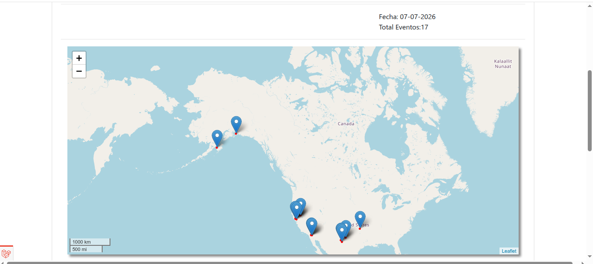
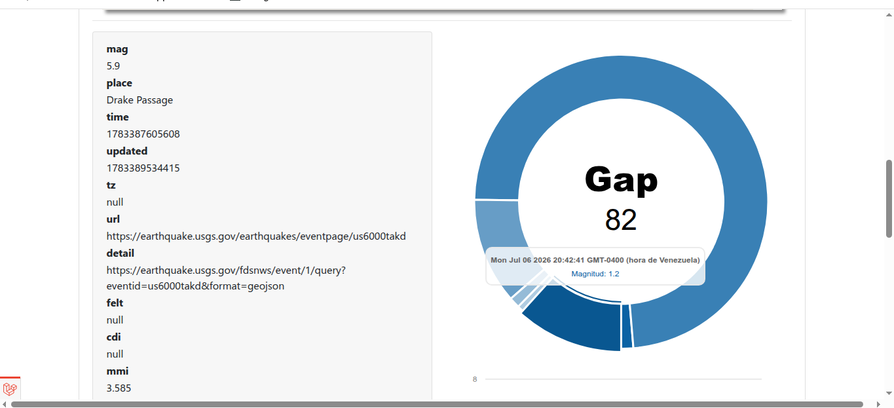

<h1 align="center">
  <br>
  <a href="https://sistemaspymesjc.blogspot.com/p/trabaja-con-nosotros.html">
    
  </a>
  <br>
  GisEM
  <br>
</h1>

<a href="https://youtu.be/YEAvFu7ccz8">
    
</a>

## Introduction

earthquake monitor web app - Hazards API - Data analysis and preventive measures in the face of seismic activity.

<p align="center">
  
  
  
  <a href="https://discord.gg/ntpz4aRHHy">
    
  </a>
</p>

<p align="center">
  <a href="#about">About</a> •
   <a href="#contributors">Contributors</a> •
  <a href="#features">Features</a> •
  <a href="#setup">Setup</a> •
  <a href="#installation">Installation</a> •
  <a href="#access"> Access</a> •
   <a href="#support"> Support</a> •
  <a href="#donations"> Donations</a> •
</p>



## About
A powerful Open Source Business Forum that can be installed on your server.Open source Laravel Forum

## Contributors
We thank everyone who contributes to this project.

* **Jonathan Castro** - *Software Engineer* - [jonathancastrodeveloper](https://github.com/jonathancastroccs)

## Starting

_These instructions will allow you to get a copy of the project running on your local machine for development and testing purposes._


## Setup

- PHP 8.3 >=
- PostgreSQL (Or MySQL)
- [Composer](https://getcomposer.org/)

## Additional details on dependencies

Assuming you're running Ubuntu, and then install all dependencies from the following list:

sudo apt-get install php8.3 php8.3-pgsql php8.3-mysql php8.3-intl php8.3-json php8.3-mbstring

## Installation

The following steps are meant to be used on a development server.

- Option 1: Install with Composer

```bash
$ composer create-project sistemaspymesjc/gisem
``` 

- Option 2: Clone Project

```bash
$ git clone https://github.com/sistemaspymesjc/gisem.git
``` 

- Pull Project Dev Branch

```bash
$ git pull dev
``` 
- Navigate to the root of the Laravel project

```bash
$ cd gisem
``` 
- Setup vendor libraries 

```bash
$ composer install
```

- Setup .env file and create database
- Avoid changing the author data as this may cause problems when running the project.

- Copy .env.example config and generate Key project 

```bash
$ cp .env.example .env
``` 
```bash
$ php artisan key:generate
``` 
```bash

Second step Create New Database Example: gisem

APP_ENDPOINT_FACTORY=https://earthquake-usgs-gov.translate.goog

database connection

DB_DATABASE=your_database
DB_USERNAME=your_username
DB_PASSWORD=your_password
```

```bash
$ php artisan migrate
```

- Run server

```bash
$ php artisan serve
```


## Technologies 🛠️

* [Laravel 13](https://laravel.com/docs/13.x)
* [Email Tool](https://mailtrap.io?ref=jonathan61)  
* [Hosting Tool](https://namecheap.pxf.io/rnOVB5) 


## Author ✒️

* **Jonathan Castro** - *Web Developer* - [jonathancastrodeveloper](https://github.com/jonathancastroccs)


## Support

_foroworkers@istemaspymesjc.online_

* If you would like a business forum with many extra features, please contact us with your requirements and budget. Thank you.

## Donations

* [Paypal](https://www.paypal.com/paypalme/programadorjonathan) - Thank you very much for your contribution.

* [Ko-Fi](https://ko-fi.com/foroworkers) - Thank you very much for your contribution.

* [Patreon](https://www.patreon.com/c/foroworkers) - Thank you very much for your contribution.


